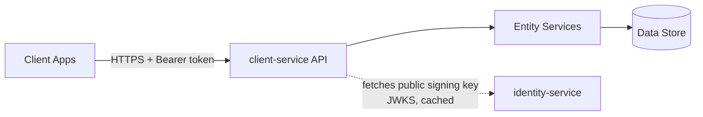

# client-service — Architecture Overview

Client relationship management for the Flowtona platform. Handles
clients, the sites they operate, and the contacts at each — the core
entities field service businesses manage work against.

## What it does

- **Clients** — a business's own customers. Each belongs to exactly
  one tenant; created, listed, updated, and archived (never hard-
  deleted) through this service.
- **Sites** — physical locations a client operates, each with an
  address. A client's first site is automatically its primary site;
  at most one site per client can hold that status at a time.
- **Contacts** — people to reach at a client, optionally tied to a
  specific site or kept at the client level. A contact must always
  have at least one of an email or a phone number, even after a
  partial update.
- **Tenant isolation** — every read and write is scoped to the tenant
  in the caller's verified access token, never anything supplied in
  the request itself; a resource belonging to another tenant, or
  simply not existing, both return an identical 404.

## Components



- **API** — the public-facing surface: clients, sites, contacts, each
  under `/v1`.
- **Entity Services** — the business logic layer: one service per
  resource, orchestrating each other directly where one resource's
  rules depend on another's (a site's contacts, a contact's site).
- **Data Store** — persisted clients, sites, and contacts.
- **identity-service** — client-service verifies every access token
  itself, locally, using identity-service's published public signing
  key (JWKS) — not a per-request callback to identity-service. The key
  is fetched once and cached, not fetched again on every request.

## Architecture

Internally, the service is organised as a layered pipeline, the same
shape as identity-service's, with one structural difference: instead
of a single orchestration layer sitting above every entity service (as
identity-service's `AuthService` does), client-service's entity
services call each other directly where a workflow genuinely spans
more than one resource — a site's contacts, a contact's site. There
are only two such relationships today, each simple and well-
understood; a dedicated coordinating layer was deliberately not added
ahead of a real need for one.

```
HTTP API
    │
    ▼
Entity Services (call each other directly where needed)
    │
    ▼
Repository Protocols
    │
    ▼
Persistence (currently in-memory)
```

- **HTTP API** — thin route handlers. They translate a request into a
  call on the relevant entity service, map the result to a response,
  and otherwise contain no business logic — errors are translated into
  a consistent response shape by a single, centralized handler, not
  per-route code. One layer of the API does real HTTP-to-domain
  translation work: resolving which fields a partial update (`PATCH`)
  request actually supplied, versus which were simply left out,
  before the service layer ever sees the request.
- **Entity services** — one per resource (clients, sites, contacts).
  Each owns the business rules for its own resource, and — where a
  rule genuinely depends on another resource — asks that resource's
  own service directly, never its repository. A site's contacts are
  detached, not deleted, when the site is deleted; a contact's site
  reference is validated against that same client before it's ever
  saved.
- **Repository Protocols** — persistence is accessed only through
  structurally-typed interfaces, never a concrete implementation
  directly. Entity services are written against these Protocols, not
  against any specific storage technology.
- **Persistence** — currently in-memory (Phase 1). Repository
  implementations are interchangeable behind their Protocol
  interfaces, so PostgreSQL can eventually replace the in-memory layer
  without changing anything above it.

Auth verification sits alongside this pipeline rather than inside it —
every route depends on a token verifier that authenticates the caller
and extracts their tenant and permissions before any entity service is
ever reached, but it isn't itself part of the resource pipeline above.

## Design principles

- **Tenant isolation from the token, never the request.** A tenant
  boundary comes from the caller's verified access token, full stop —
  never a client-supplied value in a URL or request body. A request
  body containing a `tenant_id` field at all is rejected outright,
  regardless of its value.
- **Verify locally, not per-request.** client-service authenticates
  every request itself, against identity-service's published public
  key, rather than calling identity-service to ask if a token is
  valid. The external failure a caller sees is always the same — one
  uniform rejection — regardless of *why* verification failed
  internally; the specific reason is recorded for observability, not
  exposed.
- **Service-to-service orchestration, not a coordinating layer.**
  Where one resource's rules genuinely depend on another's, that
  resource's service calls the other resource's service directly —
  never its repository. A dedicated orchestration layer is added only
  once enough such relationships exist to show what one should
  actually look like, not speculatively.
- **Partial updates mean exactly what they say.** A field left out of
  a partial update request is left untouched; a field explicitly sent
  as empty is genuinely cleared. Those are two different things, and
  the API treats them as two different things throughout, not
  collapsed into one.
- **Documented as it's built.** This service is developed with a
  living architecture decision record and a full history of the
  reasoning behind its non-obvious choices, kept alongside the
  codebase internally.

---

*This is a high-level overview. Detailed design documentation is
maintained internally.*