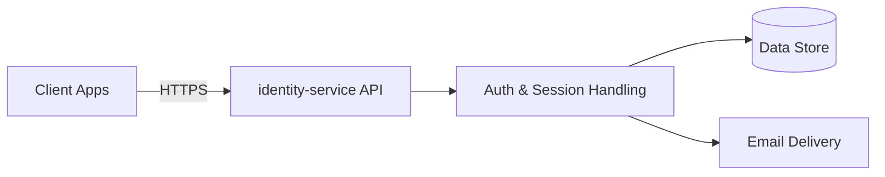

# identity-service — Architecture Overview

Authentication and authorization service for the Flowtona platform.
Handles account creation, login, session management, and access
control across Flowtona's multi-tenant model, where a single user may
belong to more than one business.

## What it does

- **Accounts** — self-serve signup, email verification, password
  management.
- **Tenants & memberships** — each signup creates a business
  ("tenant"); a user's role within a tenant determines what they can
  do there. A user can belong to multiple tenants (e.g. a technician
  who works for more than one business).
- **Invitations** — tenant owners invite teammates by email; accepting
  an invite creates a new account or links an existing one.
- **Sessions** — short-lived access tokens paired with longer-lived,
  rotating refresh tokens, so a client stays signed in without
  re-entering credentials on every request, while compromised sessions
  can be detected and terminated.
- **Permissions** — a small set of fixed roles (owner, dispatcher,
  technician) map to what each person can access within a tenant.

## Components

- **API** — the public-facing surface: signup, login, session refresh,
  invitations, verification.
- **Auth & Session Handling** — the business logic layer: account
  rules, tenant/membership rules, token issuance and rotation.
- **Data Store** — persisted accounts, tenants, memberships,
  invitations, and session state.
- **Email Delivery** — verification links and invitation emails.

## Design principles

- **Multi-tenant by design.** A tenant is a lightweight boundary
  around a business; the service doesn't own business-profile data
  (billing, address) — that belongs to a separate part of the
  Flowtona platform.
- **Defense in depth on sessions.** Sessions use short-lived
  credentials with automatic rotation, so a leaked credential has a
  limited window of use, and reuse of an already-rotated credential is
  treated as a signal worth acting on.
- **Fail safe, not fail closed, on non-critical steps.** Email
  delivery failures don't block account creation; a new account is
  usable immediately, with certain actions gated behind a confirmed
  email address.
- **Documented as it's built.** This service is developed with a
  living architecture decision record and full sequence-diagram
  coverage of its core flows, kept alongside the codebase internally.

---

*This is a high-level overview. Detailed design documentation is
maintained internally.*